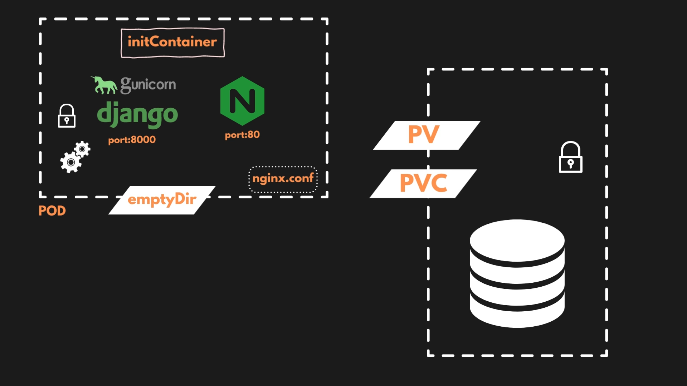
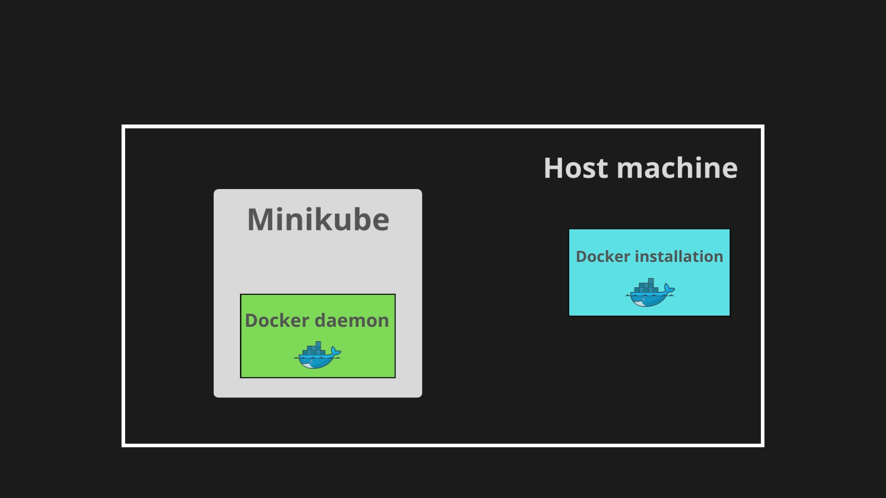

# Deploy Django locally with Kubernetes (Minikube)

### The desired state:

<p align="center">
  
</p>

Deployment will include 2 pods:

* The first running a Gunicorn/Django container and an Nginx container
* The second running a Postgres database

Other K8s components used:

* initContainer (to collect Django static files)
* configmap (for environment variables)
* secrets (for sensitive variables)
* emptyDir (for static content)
* persistent volume and claim (for database storage)

### Watch out!

<p align="center">
  
</p>

To use a local image that you've built for your Django app, you can switch to Minikube's local Docker engine as opposed to using your own local Docker engine.

```
minikube docker-env

## point your shell to minikube's docker-daemon
eval $(minikube -p minikube docker-env)

## undo i.e. go back to your own docker env
eval $(minikube docker-env --unset)
```

### Deployment steps

* base64 encode secrets
`echo -n postgresdb | base64`

* check minikube is running
`minikube status`

* apply database templates
```
export LOC='/path/to/k8s/folder/'

kubectl apply -f $LOC/database/secret.yaml
kubectl apply -f $LOC/database/storage.yaml
kubectl apply -f $LOC/database/deployment.yaml
kubectl apply -f $LOC/database/service.yaml
```

* get the database local IP and place it in the application configmap
```
kubectl get services
nano $LOC/application/configmap.yaml
```

* apply application templates
```
kubectl apply -f $LOC/application/secret.yaml
kubectl apply -f $LOC/application/configmap.yaml
kubectl apply -f $LOC/application/deployment.yaml
kubectl apply -f $LOC/application/service.yaml
```

* get the app pod name and exec into container to do database migration (optional)
```
kubectl get pods
kubectl exec -it <pod name> -- /bin/bash
python manage.py makemigrations
python manage.py migrate
```

* port forwarding to reach the Django app from your browser
`kubectl port-forward service/<service name> <local port eg. 3000>:<container port eg. 80>`


* tear down
`kubectl delete all --all`